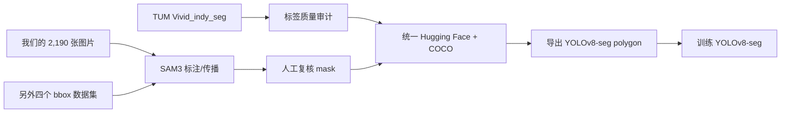

3D bbox https://tum-avs.github.io/A2RL_Dataset_website/
StreamPETR
https://universe.roboflow.com/racecar/indy_racecar

```mermaid
flowchart LR
    A["我们的 2,190 张图片"] --> S["SAM3 标注/传播"]
    B["TUM Vivid_indy_seg"] --> Q["标签质量审计"]
    C["另外四个 bbox 数据集"] --> S
    S --> R["人工复核 mask"]
    Q --> H["统一 Hugging Face + COCO"]
    R --> H
    H --> D["导出 YOLOv8-seg polygon"]
    D --> T["训练 YOLOv8-seg"]
```