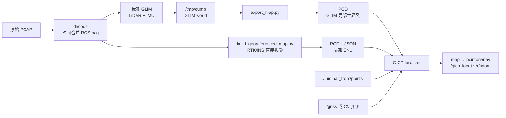

## 建图路线 A：标准 GLIM LiDAR-IMU SLAM


## 建图路线 B：RTK/INS 直接投影
第一条有效 Atlas fix 被选作 ENU 原点：

```
anchor = (lat₀, lon₀, alt₀)
```

每条 LLA 先转换成 ECEF：

```
p_ecef = f_WGS84(lat, lon, alt)
```

再转换成局部 ENU：

```
p_enu = R_enu_ecef(anchor) · (p_ecef - p_ecef_anchor)
```

因此此时：

```
x = East
y = North
z = Up
origin = 第一条有效 GNSS fix
```

这是当前仓库中真正明确建立 ENU 地图的路径。