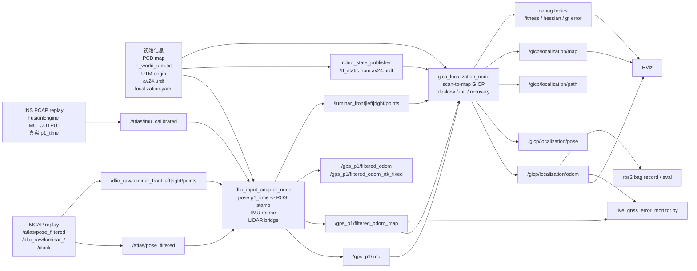
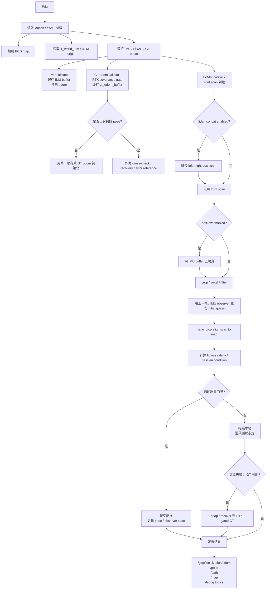

录制了GLIM的前端demo
现在的online adapter同时消耗pcap中的IMU p1 time来计算时间，然后用mcap中的剩余信息

这说明 driver/recording 把 burst arrival pattern 写进了 `header.stamp`。
**不能直接用原始 MCAP IMU stamp 做精确 IMU preintegration / deskew / live GICP propagation**。
- **如果要真实 IMU sample time，只能从同次 INS PCAP 解析 `IMU_OUTPUT.p1_time`**，因为 MCAP 的 `sensor_msgs/Imu` 已经没有这个字段。

