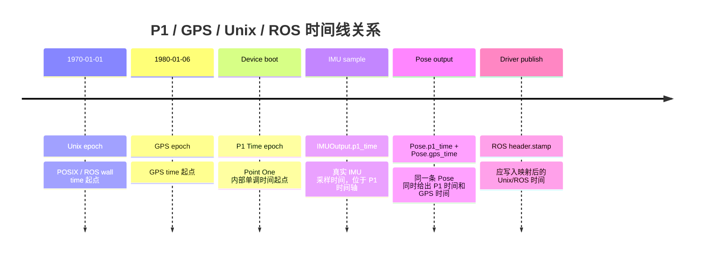

```mermaid
timeline
    title P1 / GPS / Unix / ROS 时间线关系
    1970-01-01 : Unix epoch
               : POSIX / ROS wall time 起点
    1980-01-06 : GPS epoch
               : GPS time 起点
    Device boot : P1 Time epoch
                : Point One 内部单调时间起点
    IMU sample : IMUOutput.p1_time
               : 真实 IMU 采样时间，位于 P1 时间轴
    Pose output : Pose.p1_time + Pose.gps_time
                : 同一条 Pose 同时给出 P1 时间和 GPS 时间
    Driver publish : ROS header.stamp
                   : 应写入映射后的 Unix/ROS 时间
```

