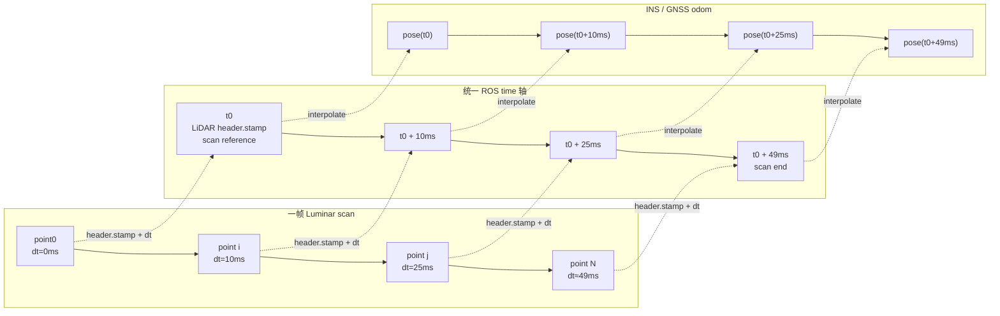
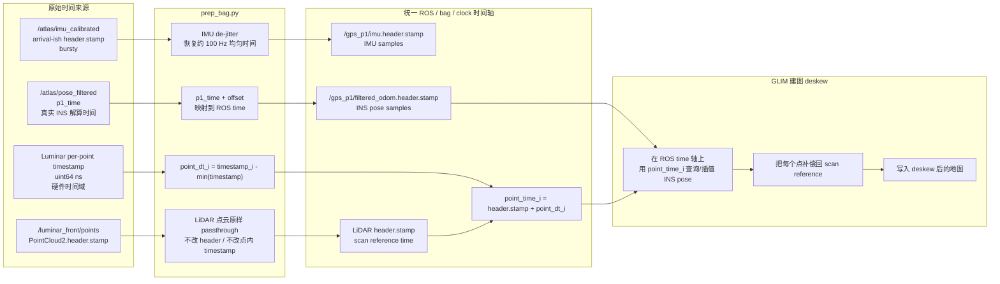

系统最后只想要一条统一时间轴：ROS time

IMU、GNSS odom、LiDAR scan 都必须落到这条轴上。LiDAR 点内 timestamp 主要只用来描述“一帧内部每个点相差多少时间。

```mermaid
flowchart LR
  subgraph AXIS["统一 ROS time 轴"]
    T0["t0<br/>LiDAR header.stamp<br/>scan reference"]
    T1["t0 + 10ms"]
    T2["t0 + 25ms"]
    T3["t0 + 49ms<br/>scan end"]
    T0 --> T1 --> T2 --> T3
  end

  subgraph LIDAR["一帧 Luminar scan"]
    P0["point0<br/>dt=0ms"]
    P1["point i<br/>dt=10ms"]
    P2["point j<br/>dt=25ms"]
    P3["point N<br/>dt≈49ms"]
    P0 --> P1 --> P2 --> P3
  end

  subgraph INS["INS / GNSS odom"]
    O0["pose(t0)"]
    O1["pose(t0+10ms)"]
    O2["pose(t0+25ms)"]
    O3["pose(t0+49ms)"]
    O0 --> O1 --> O2 --> O3
  end

  P0 -. "header.stamp + dt" .-> T0
  P1 -. "header.stamp + dt" .-> T1
  P2 -. "header.stamp + dt" .-> T2
  P3 -. "header.stamp + dt" .-> T3

  T0 -. "interpolate" .-> O0
  T1 -. "interpolate" .-> O1
  T2 -. "interpolate" .-> O2
  T3 -. "interpolate" .-> O3
```

```mermaid
flowchart LR
  subgraph RAW["原始时间来源"]
    A1["/atlas/imu_calibrated<br/>arrival-ish header.stamp<br/>bursty"]
    A2["/atlas/pose_filtered<br/>p1_time<br/>真实 INS 解算时间"]
    A3["/luminar_front/points<br/>PointCloud2.header.stamp"]
    A4["Luminar per-point timestamp<br/>uint64 ns<br/>硬件时间域"]
  end

  subgraph PREP["prep_bag.py"]
    B1["IMU de-jitter<br/>恢复约 100 Hz 均匀时间"]
    B2["p1_time + offset<br/>映射到 ROS time"]
    B3["LiDAR 点云原样 passthrough<br/>不改 header / 不改点内 timestamp"]
    B4["point_dt_i = timestamp_i - min(timestamp)"]
  end

  subgraph ROS["统一 ROS / bag / clock 时间轴"]
    C1["/gps_p1/imu.header.stamp<br/>IMU samples"]
    C2["/gps_p1/filtered_odom.header.stamp<br/>INS pose samples"]
    C3["LiDAR header.stamp<br/>scan reference time"]
    C4["point_time_i = header.stamp + point_dt_i"]
  end

  subgraph GLIM["GLIM 建图 deskew"]
    D1["在 ROS time 轴上<br/>用 point_time_i 查询/插值 INS pose"]
    D2["把每个点补偿回 scan reference"]
    D3["写入 deskew 后的地图"]
  end

  A1 --> B1 --> C1
  A2 --> B2 --> C2
  A3 --> B3 --> C3
  A4 --> B4
  B4 --> C4
  C3 --> C4

  C2 --> D1
  C4 --> D1
  D1 --> D2 --> D3
```